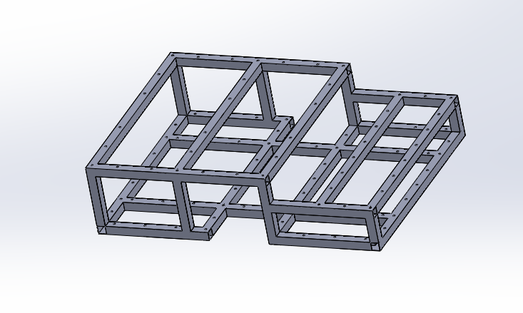

# In development....

# 🤖 Autonomous Mobile Robot (AMR) Controller – University of Moratuwa

This repository documents the design and development of a **low-cost, feature-rich AMR (Autonomous Mobile Robot) platform** intended for indoor environments such as warehouses, factories, and hospitals. The robot combines real-time sensing, robust motor control, modular construction, and remote-monitoring capabilities—engineered by undergraduates at the Department of Electronic & Telecommunication Engineering, University of Moratuwa.

  
  

---

## 🧪 Project Context
This project was undertaken for **EN2160 – Electronic Design Realization** as a collaborative team assignment. The aim was to replicate—then innovate on—the commercial **Omron LD-60** AMR while keeping costs low.

> ✨ **Key Objective:** Build a reliable mobile robot capable of autonomous material handling in structured indoor environments.

---

## 🧩 Key Features
- ✅ **Autonomous Navigation** with obstacle detection (LakiBeam 1 S LiDAR)  
- ✅ **Jetson Nano** on-board SLAM & object recognition  
- ✅ **Real-time Telemetry** over Wi-Fi (Mercusys MW600UH) with future fleet-management scalability  
- ✅ **Closed-loop NEMA 24 Steppers** with 10 : 1 planetary gearboxes for precise, high-torque motion  
- ✅ **USB Touch Display** providing a user-friendly on-robot interface  
- ✅ **Efficient DC-DC Power Conversion** for motor drivers and logic systems  
- ✅ **Modular Aluminium & Steel Enclosure** with an industrial aesthetic  

---

## 🧩 System Architecture

  

---

## 🔩 Mechanical Design

**Key parameters**

- **Dimensions** : 82.5 cm × 60 cm × 20 cm (L × W × H)  
- **Gear Ratio** : 10 : 1  
- **Wheel Diameter** : 20 cm  
- **Wheel Configuration** : 2-wheel differential drive + 4 castors  

| View | Description |
|------|-------------|
|  | Side view |
|  | Bottom isometric |
|  | Exploded top view |
|  | Enclosure & caster alignment |
|  | Frame skeleton |
|  | Drive-module layout |
|  | Wheel & motor configuration |
|  | Steel chassis |

> The CAD model is for **measurement verification & demonstration only**. Not direct manufacturing.

### Additional Modules

| Component | Preview |
|-----------|---------|
| **Custom Motor Coupler** |   |
| **Steel Chassis**        |  |
| **Drive Wheel**          |  |
| **Modified Castor**      |  |

---

## 📦 Hardware Specifications

| Component | Selection | Rationale |
|-----------|-----------|-----------|
| **MCU**          | ATmega32U4 | USB, ADC, I²C, USART, rich GPIO set |
| **SBC**          | Jetson Nano | On-board SLAM, GPU-accelerated vision, ROS-ready |
| **LiDAR**        | LakiBeam 1 S | 270 ° FOV, 18 k samples/s, Ethernet UDP |
| **Motors**       | Closed-loop NEMA 24 + 10:1 GB | High torque & encoder feedback |
| **IMU**          | Bosch BNO055 | Integrated sensor-fusion output |
| **Communication**| Mercusys MW600UH | Dual-band, high-power Wi-Fi |
| **Display**      | 4.3 ″ HDMI Touch | Local diagnostics & control |
| **Enclosure**    | Aluminium rails + powder-coated steel | Strength & clean finish |

---

## 🖥️ Custom PCBs

| Board | Top / 3D / Assembled | Summary |
|-------|----------------------|---------|
| **Microcontroller PCB** |    | ATmega32U4, encoder capture, USB CDC |
| **Power Distribution** |    | 48 V boost & 5 V buck regulation |
| **Encoder Buffer** |    | Differential-to-TTL conditioning |
| **IMU Adapter** |    | Level-shifting & filtering for BNO055 |

---

## ⚡ Power Architecture

| Stage | Purpose |
|-------|---------|
| **12 V → 48 V Boost** | Stepper-driver supply |
| **24 V / 12 V → 5 V Buck** | SBC, sensors, display |
| **Water-proof DC-DC units** | Added ruggedness for indoor operation |

---

## 📈 Performance Metrics

- **Estimated Total Weight** : **28.8 kg**  
- **Output Torque @ Wheel** : **≈ 6.0 N·m**  
- **Acceleration** : **≈ 5.88 m s⁻²**  
- **Displacement Accuracy** : **≈ 2.4 mm / step** (Changed)  

---

## 🧠 Intelligence Stack
| Layer | Description |
|-------|-------------|
| **SLAM & Obstacle Avoidance** | Real-time LiDAR processing on Jetson Nano |
| **Low-level Motion Control** | Step-pulse generation via ATmega32U4 |
| **System Communication** | USB CDC + UART |
| **Future Plans** | ROS 2 integration & multi-robot coordination |

---

## Challenges 

---

## 🗂 Documentation

- [📘 Current Design Report (PDF)](./Design_Report.pdf)  
- [📦 Image Assets](./images)

---

## 📣 Future Enhancements

- 🔋 Battery Management System (BMS) with SoC tracking  
- 📦 Swappable payload modules  
- 🧭 Autonomous docking & charging  
- 🌐 Full ROS 2 support with fleet-level coordination  
- 📊 Cloud dashboard & OTA updates  

---

## 👥 Stakeholders & Use Cases

- 🏭 Warehouse logistics automation  
- 🏥 Hospital supply transport  
- 🛍️ Retail floor delivery  
- 🎓 Academic research labs  

---

## 🏁 Conclusion
This prototype balances **industrial performance** with **academic accessibility**, demonstrating that carefully-chosen low-cost components can rival premium AMR solutions.

> _Designed by students, built for the future of autonomous mobility._
