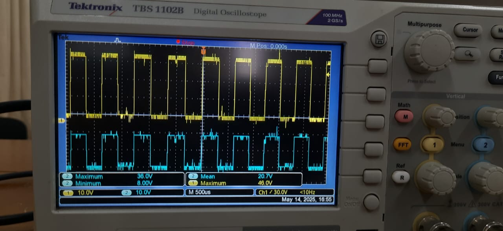

# In development....

# 🤖 Autonomous Mobile Robot (AMR) Controller – University of Moratuwa

This repository documents the design and development of a **low-cost, feature-rich AMR (Autonomous Mobile Robot) platform** intended for indoor environments such as warehouses, factories, and hospitals. The robot combines real-time sensing, robust motor control, modular construction, and remote-monitoring capabilities—engineered by undergraduates at the Department of Electronic & Telecommunication Engineering, University of Moratuwa.

  
  

---

## 🧪 Project Context
This project was undertaken for **EN2160 – Electronic Design Realization** as a collaborative team assignment. The aim was to replicate—then innovate on—the commercial **Omron LD-60** AMR while keeping costs low.

> ✨ **Key Objective:** Build a reliable mobile robot capable of autonomous material handling in structured indoor environments.

---

## 🧩 Key Features
- ✅ **Autonomous Navigation** with obstacle detection (LakiBeam 1 S LiDAR)  
- ✅ **Jetson Nano** on-board SLAM & path planning 
- ✅ **Bare-metal Atmega32U4 firmware** for deterministic timing and high-precision motor control
- ✅ **Real-time Telemetry** over UDP with future fleet-management scalability 
- ✅ **Remote Controlling** for initial Mapping of the environment over WiFi
- ✅ **Closed-loop NEMA 24 Steppers** with for precise, high-torque motion  
- ✅ **7.0' USB Touch Display** providing a user-friendly on-robot interface  
- ✅ **Efficient DC-DC Power Conversion** for motor drivers and logic systems  
- ✅ **Modular Aluminium & Steel Enclosure** with an industrial aesthetic  
---

## 🧩 System Architecture

  

---

## 🔩 Mechanical Design

**Key parameters**

- **Dimensions** : 82.5 cm × 60 cm × 20 cm (L × W × H)  
- **Gear Ratio** : 10 : 1  
- **Wheel Diameter** : 20 cm  
- **Wheel Configuration** : 2-wheel differential drive + 4 castors  

| View | Description |
|------|-------------|
|  | Isometric View from front |
|  | Back view |
|  | Isometric view from back |
|  | Top view |
|  | Side View |
|  | Wheel layout |
|  | Wheel & motor configuration |
|  | Steel chassis |

> The CAD model is for **measurement verification & demonstration only**. Not direct manufacturing. The coupler, Back motor Mount, and enclosing lid's designs were altered in the manufactured assembly.

### Additional Images

| Component | Preview |
|-----------|---------|
| **Custom Motor Coupler** |   |
| **Steel Chassis**        |  |
| **Drive Wheel**          |  |
| **Modified Castor**      |  |
| **Motor Placement**      |  |

---
---
## 🥊 Technical Challenges

## 1. Encoder Signal Acquisition for MCU Integration

### Problem
Acquiring encoder readings from closed-loop stepper motors for sensor fusion and LIDAR-based mapping presented significant challenges. The quadrature encoder signals are typically designed to interface directly with the motor controller, making MCU integration complex.

### Attempted Solutions

#### Approach 1: Y-Junction Signal Splitting
**Method:** Split encoder signal lines using Y-junctions, directing one branch to the motor controller and another to the MCU.

**Results:** 
- Encoder counts showed significant offset from actual readings
- Motors exhibited vibration and jerky movement
- Signal integrity compromised due to impedance mismatch

#### Approach 2: Single-Mode Buffer Implementation
**Method:** Implemented 4-channel single-mode buffering using SN74HC125N ICs for all encoder channels (A+, A-, B+, B-).
| Quadrature encoder signal from 2 channels | Before and after buffering, Amplitude is reduced at the output unexpectedly |
|---------|---------|
|  |  |

**Specifications:**
- Buffer selected to match encoder slew rate and voltage levels
- Designed for proper fan-out capability
- Target frequency: Up to 3600 RPM motor operation

**Results:**
- Performance remained unsatisfactory
- Issues likely attributed to low-quality, locally sourced buffer ICs

#### Approach 3: High-Quality Buffers with Differential Receivers
**Method:** Combined imported SN74HC125N buffers with SN75157DR differential receiver ICs.

**Results:**
- ✅ Accurate encoder reading up to 500 RPM with zero count loss
- ⚠️ Above 500 RPM: ~3 count loss per 2000 counts
- ❌ Count loss increased approximately quadratically with every 100 RPM increment

## 2. Mechanical Design: Wheel Selection and Ground Clearance

### Challenge
Initial 15cm diameter wheels provided insufficient ground clearance when integrated with the motor and chassis assembly, limiting the robot's ability to traverse obstacles.

### Solution
- **Wheel Upgrade:** Increased diameter from 15cm to 20cm
- **Custom Coupling:** Designed and manufactured a [custom motor coupler](images/CouplerTop.jpg)
- **Ground Clearance:** Achieved >4cm clearance to meet traversal requirements

## 3. PCB Design and Communication Issues

### Pin Mapping Complications
**Problem:** Rapid development cycle led to suboptimal pin assignments, resulting in one motor being controlled by a 10-bit timer lacking hardware-controlled CTC (Clear Timer on Compare) mode.

**Initial Workaround:**
-  Generated a 50 % duty-cycle “pseudo-step” PWM. To span the full RPM range, we had to switch prescalers on-the-fly - acceptable for the first milestone, but sub-optimal.

**Solution:**
- Dual prescaler configuration to cover entire RPM range
- Successfully met first evaluation requirements

### Additional Issues Identified
- **Encoder Pin Mapping:** Incorrect pin assignments for encoder interfaces
- **USB Communication:** Instability due to missing external oscillator for MCU timing

### Next Steps
**PCB Revision:** A new PCB revision is planned to address:
- Corrected pin mapping for all motor and encoder interfaces  
- Integration of external oscillator for stable USB communication
- Implementation of lessons learned from current design iteration

---

*These challenges provided valuable insights into signal integrity, mechanical design constraints, and the importance of careful PCB layout planning in robotics applications.* 

--- 

## 📅Major To-dos
- Implement Custom SLAM and path planning alogorithem
- Implement velocity profiling in for the lower layer controller
- Develop an remote debugging and controlling interface for the robot
---

## 📦 Off-the-shelf Electronics components

| Component | Selection | Rationale |
|-----------|-----------|-----------|
| **MCU**          | ATmega32U4 | USB, ADC, I²C, USART, rich GPIO set |
| **SBC**          | Jetson Nano | On-board SLAM, ROS2-Humble, and runnning custom SLAM implementation |
| **LiDAR**        | LakiBeam 1 S | 270 ° FOV, 18 k samples/s, Ethernet UDP |
| **Motors**       | Closed-loop NEMA 24 + 10:1 GB | High torque & encoder feedback |
| **IMU**          | Bosch BNO055 | Integrated sensor-fused drift/noise free Euler angles |
| **Communication**| Mercusys MW600UH | Dual-band, high-power Wi-Fi |
| **Display**      | 7 ″ HDMI Touch | User Interface, Local diagnostics & control |
| **DC-DC Converters**    | 5V, 12V Buck converters and 1500W boost Conveter for motors |  |

---
## 🖥️ Custom PCBs

| Board | Preview&nbsp;(Top / 3D / Assembled) | Summary |
|-------|-------------------------------------|---------|
| **Microcontroller&nbsp;PCB (REV 1)** |    | **ATmega32U4**–based board that: • samples IMU data, battery voltage, and cliff-sensor inputs; • drives stepper motors via pulse-direction outputs; • converts differential encoder signals to single-ended with on-board line receivers; • exposes a USB-C port (USB-CDC) to the Jetson Nano; • provides an interrupt line for the emergency-stop button. |
| **Power&nbsp;Distribution&nbsp;PCB (REV 1)** |    | Steps the 22 V battery rail down to **48 V, 12 V, 5 V, and 3.3 V** using plug-in buck-converter modules and routes the main supply through the on-board power switch. |
| **Encoder&nbsp;Buffer&nbsp;PCB** |    | Buffers all **eight** quadrature-encoder channels (two motors) and actively drives them so the signals can be split to both the MCU and the stepper-motor drivers without loading or skew. |
| **IMU&nbsp;Adapter&nbsp;PCB** |    | Provides modular mounting options for the IMU, to minimise magnetic interference and easy replacement; connects to the main board via a dedicated ISP adapter cable. |

---

## 📈 Performance Metrics

- **Estimated Total Weight** : **28.8 kg**  
- **Output Torque @ Wheel** : **≈ 6.0 N·m**  
- **Acceleration** : **≈ 5.88 m s⁻²**  
- **Displacement Accuracy** : **≈ 2.4 mm / step** (Changed)  

---

## 🧠 Intelligence Stack
| Layer | Description |
|-------|-------------|
| **SLAM & Obstacle Avoidance** | Real-time LiDAR processing and SLAM on Jetson Nano |
| **Low-level Motion Control** | Step-pulse generation via ATmega32U4 |
| **System Communication** | USB CDC  |

---

## 🗂 Documentation

- [📘 Current Design Report (PDF)](./Design_Report.pdf)  
- [📦 Image Assets](./images)

---

## 📣 Future Enhancements

- 🔋 Battery Management System (BMS) with SoC tracking  
- 📦 Swappable payload modules  
- 🧭 Autonomous docking & charging  
- 🌐 Full ROS 2 support with fleet-level coordination  
- 📊 Cloud dashboard & OTA updates  

---

## 👥 Stakeholders & Use Cases

- 🏭 Warehouse logistics automation  
- 🏥 Hospital supply transport  
- 🛍️ Retail floor delivery  
- 🎓 Academic research labs  

---

## 🏁 Conclusion
This prototype balances **industrial performance** with **academic accessibility**, demonstrating that carefully-chosen low-cost components can rival premium AMR solutions.

> _Designed by students, built for the future of autonomous mobility._
